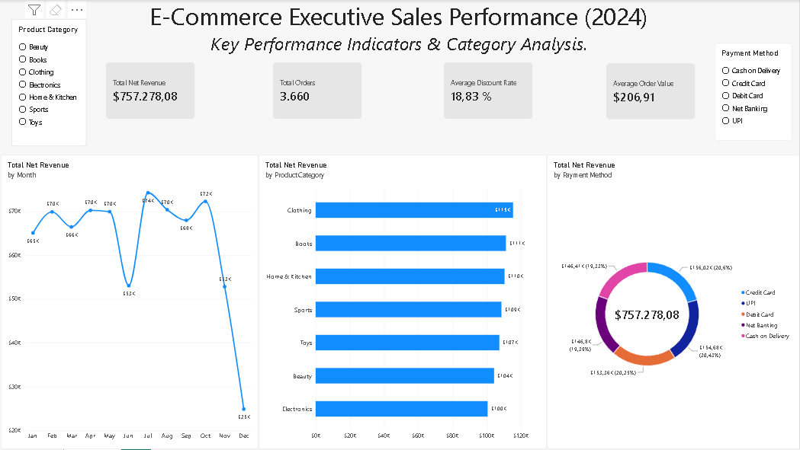

# PowerBI-Ecommerce-Sales-Dashboard
Executive Power BI Sales Dashboard analyzing 3.6K+ e-commerce transactions for FY 2024.

## Overview & Metrics
* **Total Net Revenue:** $757.28K
* **Total Orders:** 3,660
* **Average Order Value (AOV):** $206.91
* **Average Discount Rate:** 18.83%

## Technical Highlights
* **Power Query ETL:** Resolved regional locale issues to correctly parse decimal prices from the source CSV.
* **DAX Measures:** Custom measures for Net Revenue, Order Count, AOV, and Discount Averages.

## Key Takeaways
1. Revenue remained steady at $68.8K/month, with peak performance in July/October and a sharp dip in June.
2. Clothing and Books led overall sales, but revenue is well-balanced across all 7 product categories.
3. The average discount rate of 18.8% sustained high order volume without affecting revenue margins.
